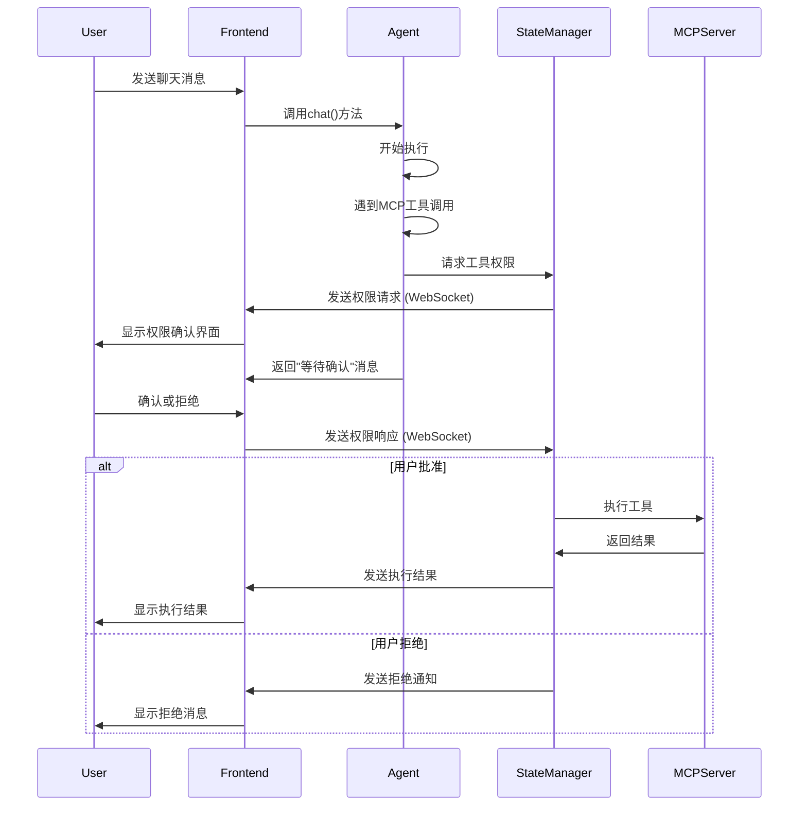

# Agent工具权限确认机制实现方案

## 问题描述

原有的Agent架构中，MCP工具调用时需要用户确认环节，但当前的集成方式存在以下问题：

1. **阻塞式等待**：`tool_permission_manager.request_tool_permission` 会阻塞等待用户响应
2. **聊天流中断**：Agent在等待权限确认时，整个聊天流会被阻塞
3. **前端交互断裂**：用户无法在聊天过程中自然地进行权限确认

## 解决方案

### 1. 架构设计

我们实现了一个非阻塞的权限确认机制，包含以下核心组件：

```txt
┌─────────────────┐    ┌──────────────────┐    ┌─────────────────┐
│   Frontend      │    │  Agent Core      │    │ State Manager   │
│                 │    │                  │    │                 │
│ ┌─────────────┐ │    │ ┌──────────────┐ │    │ ┌─────────────┐ │
│ │ WebSocket   │◄┼────┼►│ Tool Wrapper │◄┼────┼►│ Permission  │ │
│ │ Handler     │ │    │ │              │ │    │ │ Manager     │ │
│ └─────────────┘ │    │ └──────────────┘ │    │ └─────────────┘ │
│                 │    │                  │    │                 │
│ ┌─────────────┐ │    │ ┌──────────────┐ │    │ ┌─────────────┐ │
│ │ Permission  │ │    │ │ Chat Flow    │ │    │ │ Context     │ │
│ │ Dialog      │ │    │ │ Handler      │ │    │ │ Manager     │ │
│ └─────────────┘ │    │ └──────────────┘ │    │ └─────────────┘ │
└─────────────────┘    └──────────────────┘    └─────────────────┘
```

### 2. 核心组件

#### A. Agent状态管理器 (`agent_state_manager.py`)

**功能**：

- 管理Agent的执行状态
- 处理工具权限请求和响应
- 维护待确认的工具列表
- 提供非阻塞的权限确认机制

**关键类**：

- `AgentExecutionState`: 执行状态枚举
- `PendingToolExecution`: 待执行工具信息
- `AgentExecutionContext`: 执行上下文
- `AgentStateManager`: 状态管理器主类

#### B. 工具包装器 (修改后的 `_wrap_mcp_tool`)

**功能**：

- 拦截MCP工具调用
- 根据风险级别决定是否需要权限确认
- 非阻塞地发送权限请求
- 返回等待确认的状态消息

#### C. 聊天流处理器 (修改后的 `chat` 方法)

**功能**：

- 集成状态管理器
- 处理权限确认流程
- 在聊天流中适当暂停和恢复执行

#### D. WebSocket处理器 (增强的 `websocket_manager.py`)

**功能**：

- 处理权限确认相关的WebSocket消息
- 与状态管理器交互
- 向前端发送权限请求通知

### 3. 工作流程



### 4. 关键特性

#### A. 非阻塞权限确认

- 工具权限请求不会阻塞Agent执行
- 通过状态管理器异步处理权限响应
- 聊天流可以继续，显示权限等待状态

#### B. 状态管理

- 每个会话维护独立的执行上下文
- 支持多个待确认工具的管理
- 自动清理过期的权限请求

#### C. WebSocket集成

- 实时的权限请求通知
- 前端可以动态响应权限确认
- 支持多种消息类型处理

#### D. 风险级别控制

- 低风险工具自动执行
- 中高风险工具需要用户确认
- 可配置的工具风险级别

### 5. 前端集成指南

#### WebSocket连接

```javascript
const ws = new WebSocket('ws://localhost:8000/agent_backend/ws/session_id');
```

#### 监听权限请求

```javascript
ws.onmessage = (event) => {
    const message = JSON.parse(event.data);
    if (message.type === 'agent_tool_permission_request') {
        showPermissionDialog(message.data);
    }
};
```

#### 发送权限响应

```javascript
function respondToPermission(executionId, approved) {
    ws.send(JSON.stringify({
        type: 'agent_tool_permission_response',
        data: {
            execution_id: executionId,
            approved: approved
        }
    }));
}
```

### 6. 消息协议

#### 权限请求消息

```json
{
    "type": "agent_tool_permission_request",
    "data": {
        "session_id": "session_123",
        "execution_id": "exec_456",
        "tool_name": "file_write",
        "parameters": {...},
        "risk_level": "high",
        "message": "Agent想要执行工具: file_write"
    }
}
```

#### 权限响应消息

```json
{
    "type": "agent_tool_permission_response",
    "data": {
        "execution_id": "exec_456",
        "approved": true
    }
}
```

#### 状态查询消息

```json
{
    "type": "get_agent_status",
    "data": {}
}
```

### 7. 实现文件

- `copilot/core/agent_state_manager.py` - 状态管理器
- `copilot/core/agent.py` - Agent核心逻辑（修改）
- `copilot/utils/websocket_manager.py` - WebSocket处理器（增强）
- `copilot/main.py` - 应用启动逻辑（修改）
- `test_agent_permission_integration.py` - 测试示例

### 8. 使用示例

```python
# 创建Agent
agent = await CoreAgent.create_with_mcp_tools(
    provider="deepseek",
    model_name="deepseek-chat"
)

# 开始聊天（会自动处理权限确认）
async for chunk in agent.chat(
    message="请帮我读取文件",
    session_id="session_123",
    enable_tools=True
):
    print(chunk, end="")
```

### 9. 优势

1. **用户体验**：权限确认自然集成到聊天流中
2. **非阻塞**：不会因为权限等待而阻塞整个系统
3. **灵活性**：支持多种风险级别和确认策略
4. **可扩展**：易于添加新的权限确认类型
5. **实时性**：通过WebSocket实现实时交互

### 10. 未来扩展

- 支持权限批量确认
- 添加权限模板和快速批准
- 实现权限审核日志
- 支持权限委托和代理确认
- 添加权限撤销机制

这个解决方案完全解决了原有架构中的阻塞问题，提供了一个流畅的用户体验和强大的权限控制机制。
