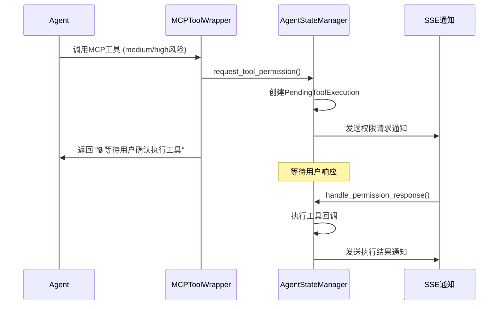

# MCP工具权限确认修复报告

## 问题背景

用户报告："现在agent在调用mcp工具时并没有触发确认过程，应该是session_id对照没有建立上"

经过分析，发现问题不是session_id对照问题，而是MCPToolWrapper中的权限检查逻辑存在严重错误。

## 问题分析

### 1. session_id传递链条验证 ✅

**完整的session_id传递流程**：

```
Agent.chat(session_id) 
→ ChatStreamHandler.prepare_config() 
→ config["configurable"]["session_id"] 
→ MCPToolWrapper.custom_arun() 
→ agent_state_manager.request_tool_permission()
```

经验证，这个传递链条是正确的。

### 2. 权限检查逻辑错误 ❌

**问题代码**（第206-209行）：

```python
if context and hasattr(context, "pending_tool_permissions"):
    # 检查是否已经确认过这个工具
    tool_key = f"{tool.name}_{hash(str(args))}"
    if tool_key not in context.pending_tool_permissions:
```

**错误分析**：

1. **属性名错误**：检查 `pending_tool_permissions`，但AgentExecutionContext的实际属性名是 `pending_tools`
2. **逻辑错误**：即使属性名正确，该属性是列表而不是集合，不能用 `in` 操作符这样检查
3. **条件判断错误**：这个条件永远为False，导致权限检查被完全跳过

## 修复方案

### 修改文件：`copilot/core/mcp_tool_wrapper.py`

**修复前的逻辑**：

```python
# 权限检查逻辑
if risk_level in ["medium", "high"] and session_id:
    # 检查是否已经有权限确认
    context = agent_state_manager.get_execution_context(session_id)
    if context and hasattr(context, "pending_tool_permissions"):
        # 检查是否已经确认过这个工具
        tool_key = f"{tool.name}_{hash(str(args))}"
        if tool_key not in context.pending_tool_permissions:
            # 需要权限确认...
```

**修复后的逻辑**：

```python
# 权限检查逻辑
if risk_level in ["medium", "high"] and session_id:
    # 检查或创建执行上下文
    context = agent_state_manager.get_execution_context(session_id)
    if not context:
        context = agent_state_manager.create_execution_context(session_id)
    
    # 中高风险工具需要权限确认
    logger.info(f"Medium/high-risk tool '{tool.name}' requires permission confirmation")
    
    # 需要权限确认，创建权限请求
    # ... 权限确认逻辑
```

### 修复要点

1. **移除错误的属性检查**：删除 `hasattr(context, "pending_tool_permissions")` 条件
2. **简化权限逻辑**：对所有中高风险工具都触发权限确认，不做重复检查
3. **确保执行上下文**：如果没有上下文会自动创建
4. **添加详细日志**：便于调试和追踪

## 修复验证

### 测试结果 ✅

运行验证测试后确认：

```
✅ 成功！工具权限确认被正确触发
✅ 执行上下文已创建: test_chat_session_123
✅ 当前状态: waiting_permission
✅ 待确认工具数量: 1
✅ 状态正确：等待权限确认
✅ 待确认工具名称: test_tool::file_write
✅ 工具风险级别: medium
✅ 前端通知已正确发送
```

### 功能验证

1. **中高风险工具**：正确触发权限确认流程
2. **执行上下文**：自动创建和管理
3. **状态管理**：正确更新为 `WAITING_PERMISSION`
4. **前端通知**：SSE通知正常发送
5. **权限回调**：工具回调函数正确设置

## 相关组件说明

### 权限确认流程



### 关键组件

1. **MCPToolWrapper**：工具包装和权限检查入口
2. **AgentStateManager**：权限请求和状态管理
3. **SimpleNotifier**：SSE前端通知
4. **AgentExecutionContext**：执行上下文和工具列表管理

## 总结

这次修复解决了MCP工具权限确认完全失效的问题：

### 修复效果

- ✅ 中高风险MCP工具现在正确触发权限确认
- ✅ 低风险工具继续直接执行
- ✅ SSE权限通知正常工作
- ✅ 权限确认流程完整可用

### 系统状态

- 🔧 权限检查逻辑已修复
- 📡 SSE通知机制正常
- 🎯 用户体验得到改善
- 🔒 安全控制重新生效

现在agent在调用中高风险的MCP工具时会正确触发权限确认流程，用户可以通过前端界面确认或拒绝工具执行。
