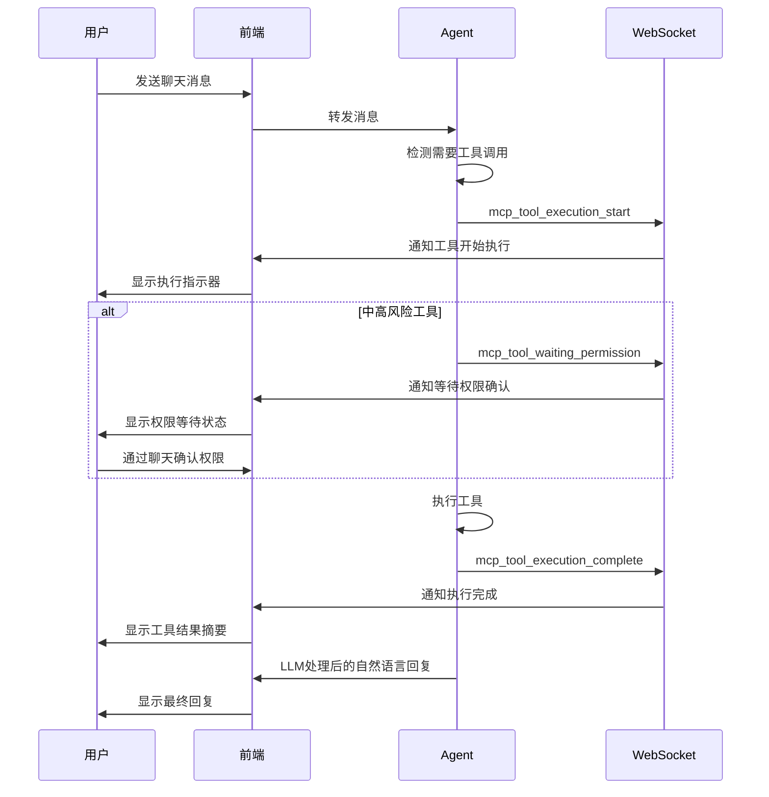

# MCP 工具 WebSocket 集成指南

## 概述

当用户与 Agent 聊天时，如果触发了 MCP 工具调用，系统会通过 WebSocket 实时推送工具执行的详细信息给前端。这样前端可以：

- 显示工具执行状态
- 展示详细的工具结果
- 提供更好的用户体验
- 让用户选择是否查看原始数据

## WebSocket 消息类型

### 1. 工具开始执行 (`mcp_tool_execution_start`)

**触发时机**: MCP 工具开始执行时

```json
{
    "type": "mcp_tool_execution_start",
    "data": {
        "tool_name": "file_system::read_file",
        "parameters": {
            "path": "/path/to/file.txt"
        },
        "risk_level": "medium",
        "start_time": "2024-01-15T10:30:00.000Z",
        "status": "executing"
    }
}
```

**字段说明**:

- `tool_name`: 工具名称（包含服务器前缀）
- `parameters`: 工具调用参数（敏感内容会被截断）
- `risk_level`: 风险级别 (`low`, `medium`, `high`)
- `start_time`: 开始执行时间 (ISO 格式)
- `status`: 执行状态，固定为 `executing`

### 2. 等待权限确认 (`mcp_tool_waiting_permission`)

**触发时机**: 中高风险工具需要用户权限确认时

```json
{
    "type": "mcp_tool_waiting_permission",
    "data": {
        "tool_name": "file_system::write_file",
        "parameters": {
            "path": "/path/to/file.txt",
            "content": "file content..."
        },
        "risk_level": "high",
        "start_time": "2024-01-15T10:30:00.000Z",
        "status": "waiting_permission"
    }
}
```

**字段说明**:

- 字段与 `mcp_tool_execution_start` 相同
- `status`: 固定为 `waiting_permission`

### 3. 工具执行完成 (`mcp_tool_execution_complete`)

**触发时机**: MCP 工具执行完成（成功或失败）时

```json
{
    "type": "mcp_tool_execution_complete",
    "data": {
        "tool_name": "file_system::read_file",
        "parameters": {
            "path": "/path/to/file.txt"
        },
        "risk_level": "medium",
        "start_time": "2024-01-15T10:30:00.000Z",
        "end_time": "2024-01-15T10:30:05.500Z",
        "success": true,
        "result": {
            "type": "text",
            "content": "文件内容在这里...",
            "raw_data": {
                "content": [
                    {
                        "type": "text",
                        "text": "文件内容在这里..."
                    }
                ]
            },
            "success": true
        },
        "status": "completed"
    }
}
```

**字段说明**:

- `end_time`: 执行结束时间 (ISO 格式)
- `success`: 执行是否成功
- `result`: 处理后的结果对象
- `status`: `completed` (成功) 或 `failed` (失败)

#### 结果对象格式

根据工具返回数据的不同，`result` 字段会有不同的格式：

**文本类型结果**:

```json
{
    "type": "text",
    "content": "处理后的文本内容",
    "raw_data": "原始返回数据",
    "success": true
}
```

**结构化数据结果**:

```json
{
    "type": "structured",
    "content": {
        "key": "value",
        "data": "..."
    },
    "raw_data": "原始返回数据",
    "success": true
}
```

**错误结果**:

```json
{
    "type": "error", 
    "content": "错误描述信息",
    "raw_data": null,
    "success": false
}
```

## 前端集成示例

### JavaScript WebSocket 监听

```javascript
class MCPToolHandler {
    constructor(websocket) {
        this.ws = websocket;
        this.activeTools = new Map(); // 跟踪活动工具
        
        this.ws.addEventListener('message', (event) => {
            const message = JSON.parse(event.data);
            this.handleMessage(message);
        });
    }
    
    handleMessage(message) {
        switch (message.type) {
            case 'mcp_tool_execution_start':
                this.handleToolStart(message.data);
                break;
            case 'mcp_tool_waiting_permission':
                this.handleToolWaitingPermission(message.data);
                break;
            case 'mcp_tool_execution_complete':
                this.handleToolComplete(message.data);
                break;
        }
    }
    
    handleToolStart(data) {
        console.log(`🔧 工具开始执行: ${data.tool_name}`);
        
        // 显示工具执行指示器
        this.showToolIndicator(data.tool_name, 'executing');
        
        // 记录活动工具
        this.activeTools.set(data.tool_name, {
            ...data,
            status: 'executing'
        });
    }
    
    handleToolWaitingPermission(data) {
        console.log(`⏳ 工具等待权限确认: ${data.tool_name}`);
        
        // 更新指示器状态
        this.showToolIndicator(data.tool_name, 'waiting_permission');
        
        // 可以在这里显示额外的权限等待提示
        if (data.risk_level === 'high') {
            this.showHighRiskWarning(data);
        }
    }
    
    handleToolComplete(data) {
        console.log(`✅ 工具执行完成: ${data.tool_name} - ${data.success ? '成功' : '失败'}`);
        
        // 移除执行指示器
        this.hideToolIndicator(data.tool_name);
        
        // 显示工具结果
        this.displayToolResult(data);
        
        // 清理活动工具记录
        this.activeTools.delete(data.tool_name);
    }
    
    showToolIndicator(toolName, status) {
        // 在聊天界面显示工具执行状态
        const indicator = document.createElement('div');
        indicator.className = `tool-indicator tool-${status}`;
        indicator.id = `tool-${toolName.replace(/[^a-zA-Z0-9]/g, '_')}`;
        
        const statusText = {
            'executing': '🔧 执行中...',
            'waiting_permission': '⏳ 等待确认...'
        };
        
        indicator.innerHTML = `
            <span class="tool-name">${toolName}</span>
            <span class="tool-status">${statusText[status]}</span>
        `;
        
        document.getElementById('chat-container').appendChild(indicator);
    }
    
    hideToolIndicator(toolName) {
        const indicator = document.getElementById(`tool-${toolName.replace(/[^a-zA-Z0-9]/g, '_')}`);
        if (indicator) {
            indicator.remove();
        }
    }
    
    displayToolResult(data) {
        if (!data.success) {
            this.showError(`工具执行失败: ${data.result.content}`);
            return;
        }
        
        const result = data.result;
        
        // 根据结果类型显示不同的UI
        switch (result.type) {
            case 'text':
                this.showTextResult(data.tool_name, result.content);
                break;
            case 'structured':
                this.showStructuredResult(data.tool_name, result.content);
                break;
            default:
                console.log('工具结果:', result);
        }
        
        // 提供查看原始数据的选项
        if (result.raw_data) {
            this.addViewRawDataOption(data.tool_name, result.raw_data);
        }
    }
    
    showTextResult(toolName, content) {
        // 在聊天界面显示文本结果摘要
        const resultElement = document.createElement('div');
        resultElement.className = 'tool-result tool-result-text';
        resultElement.innerHTML = `
            <div class="tool-result-header">
                <span class="tool-name">${toolName}</span>
                <span class="tool-status">✅ 完成</span>
            </div>
            <div class="tool-result-preview">
                ${content.substring(0, 200)}${content.length > 200 ? '...' : ''}
            </div>
        `;
        
        document.getElementById('chat-container').appendChild(resultElement);
    }
    
    showStructuredResult(toolName, content) {
        // 显示结构化数据的摘要
        const resultElement = document.createElement('div');
        resultElement.className = 'tool-result tool-result-structured';
        resultElement.innerHTML = `
            <div class="tool-result-header">
                <span class="tool-name">${toolName}</span>
                <span class="tool-status">✅ 完成</span>
            </div>
            <div class="tool-result-summary">
                返回了 ${Object.keys(content).length} 个数据字段
            </div>
        `;
        
        document.getElementById('chat-container').appendChild(resultElement);
    }
    
    addViewRawDataOption(toolName, rawData) {
        // 添加查看原始数据的按钮
        const button = document.createElement('button');
        button.className = 'view-raw-data-btn';
        button.textContent = '查看原始数据';
        button.onclick = () => {
            this.showRawDataModal(toolName, rawData);
        };
        
        // 找到对应的结果元素并添加按钮
        const resultElements = document.querySelectorAll('.tool-result');
        const lastResult = resultElements[resultElements.length - 1];
        if (lastResult) {
            lastResult.appendChild(button);
        }
    }
    
    showRawDataModal(toolName, rawData) {
        // 在模态框中显示原始数据
        const modal = document.createElement('div');
        modal.className = 'raw-data-modal';
        modal.innerHTML = `
            <div class="modal-content">
                <div class="modal-header">
                    <h3>原始数据 - ${toolName}</h3>
                    <button class="close-btn">&times;</button>
                </div>
                <div class="modal-body">
                    <pre><code>${JSON.stringify(rawData, null, 2)}</code></pre>
                </div>
            </div>
        `;
        
        document.body.appendChild(modal);
        
        // 添加关闭事件
        modal.querySelector('.close-btn').onclick = () => {
            modal.remove();
        };
    }
    
    showError(message) {
        const errorElement = document.createElement('div');
        errorElement.className = 'tool-error';
        errorElement.textContent = message;
        document.getElementById('chat-container').appendChild(errorElement);
    }
    
    showHighRiskWarning(data) {
        // 为高风险工具显示额外警告
        const warning = document.createElement('div');
        warning.className = 'high-risk-warning';
        warning.innerHTML = `
            <div class="warning-icon">⚠️</div>
            <div class="warning-text">
                高风险工具 "${data.tool_name}" 正在等待您的确认
            </div>
        `;
        document.getElementById('chat-container').appendChild(warning);
    }
}

// 使用示例
const ws = new WebSocket('ws://localhost:8000/agent_backend/ws/your_session_id');
const toolHandler = new MCPToolHandler(ws);
```

### CSS 样式示例

```css
.tool-indicator {
    display: flex;
    justify-content: space-between;
    align-items: center;
    padding: 8px 12px;
    margin: 4px 0;
    border-radius: 6px;
    font-size: 14px;
    background-color: #f0f9ff;
    border-left: 4px solid #0ea5e9;
}

.tool-indicator.tool-executing {
    background-color: #fef3c7;
    border-left-color: #f59e0b;
}

.tool-indicator.tool-waiting_permission {
    background-color: #fce7f3;
    border-left-color: #ec4899;
    animation: pulse 2s infinite;
}

.tool-result {
    margin: 8px 0;
    padding: 12px;
    border-radius: 8px;
    background-color: #f8fafc;
    border: 1px solid #e2e8f0;
}

.tool-result-header {
    display: flex;
    justify-content: space-between;
    align-items: center;
    margin-bottom: 8px;
    font-weight: 600;
}

.tool-result-preview {
    color: #64748b;
    font-size: 14px;
    line-height: 1.4;
}

.view-raw-data-btn {
    margin-top: 8px;
    padding: 4px 8px;
    font-size: 12px;
    color: #0ea5e9;
    background: none;
    border: 1px solid #0ea5e9;
    border-radius: 4px;
    cursor: pointer;
}

.view-raw-data-btn:hover {
    background-color: #0ea5e9;
    color: white;
}

.raw-data-modal {
    position: fixed;
    top: 0;
    left: 0;
    width: 100%;
    height: 100%;
    background-color: rgba(0, 0, 0, 0.5);
    display: flex;
    justify-content: center;
    align-items: center;
    z-index: 1000;
}

.modal-content {
    background: white;
    border-radius: 8px;
    width: 80%;
    max-width: 600px;
    max-height: 80%;
    overflow: hidden;
}

.modal-header {
    display: flex;
    justify-content: space-between;
    align-items: center;
    padding: 16px;
    border-bottom: 1px solid #e2e8f0;
}

.modal-body {
    padding: 16px;
    max-height: 400px;
    overflow-y: auto;
}

.modal-body pre {
    background-color: #f8fafc;
    padding: 12px;
    border-radius: 4px;
    overflow-x: auto;
}

.close-btn {
    background: none;
    border: none;
    font-size: 24px;
    cursor: pointer;
    color: #64748b;
}

.close-btn:hover {
    color: #1e293b;
}

.tool-error {
    padding: 12px;
    margin: 8px 0;
    background-color: #fef2f2;
    border: 1px solid #fecaca;
    border-radius: 6px;
    color: #dc2626;
}

.high-risk-warning {
    display: flex;
    align-items: center;
    padding: 12px;
    margin: 8px 0;
    background-color: #fffbeb;
    border: 1px solid #fbbf24;
    border-radius: 6px;
    color: #92400e;
}

.warning-icon {
    margin-right: 8px;
    font-size: 18px;
}

@keyframes pulse {
    0%, 100% {
        opacity: 1;
    }
    50% {
        opacity: 0.7;
    }
}
```

## 消息流程图



## 最佳实践

### 1. 用户体验优化

- **实时反馈**: 立即显示工具执行状态，避免用户等待时的困惑
- **分层信息**: 默认显示简洁摘要，提供查看详细信息的选项
- **视觉区分**: 使用不同颜色和图标区分工具状态和聊天内容

### 2. 性能考虑

- **消息缓存**: 缓存工具执行结果，避免重复处理
- **懒加载**: 原始数据仅在用户请求时加载
- **限制大小**: 对大型结果进行截断和分页处理

### 3. 错误处理

- **网络异常**: 处理 WebSocket 连接中断的情况
- **消息格式**: 验证接收到的消息格式
- **超时处理**: 为长时间执行的工具设置超时提示

### 4. 安全考虑

- **敏感数据**: 不在前端显示敏感参数和结果
- **权限验证**: 确保只有授权用户能查看工具结果
- **数据清理**: 定期清理缓存的工具结果数据

通过这个 WebSocket 集成，前端可以提供更加丰富和实时的用户体验，让用户清楚地了解 Agent 正在执行什么操作，并能够查看详细的执行结果。
