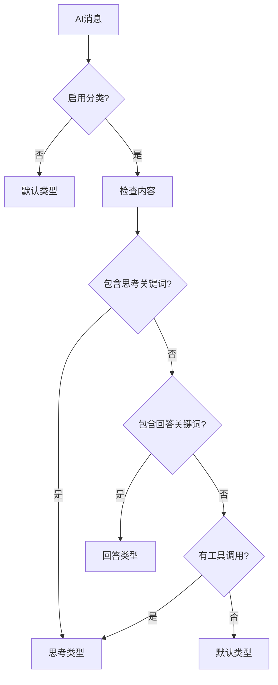

# AI消息类型分类功能

## 概述

本功能实现了在聊天流式响应中区分AI思考过程和最终回答的能力。通过分析AI消息内容，系统可以自动识别消息类型，并在JSON响应中使用不同的`type`字段进行区分。

## 功能特性

### 🎯 支持的消息类型

- **`thinking`**: AI思考过程，包含分析、规划、推理等内容
- **`answer`**: AI的最终回答内容
- **`system`**: 系统提示信息（如权限确认）
- **`error`**: 错误信息

### 🔍 智能分类算法

系统使用以下策略自动分类AI消息：

1. **关键词匹配**: 基于预定义的中英文关键词库
2. **工具调用检测**: 包含工具调用的消息归类为思考
3. **内容语义分析**: 分析消息的语义特征

## 配置说明

### 启用/禁用功能

```python
# 在 copilot/core/chat_stream_handler.py 中配置
class ChatConfig:
    ENABLE_AI_THINKING_CLASSIFICATION = True  # 启用分类功能
    THINKING_EMOJI = "🤔"  # 思考表情
    RESPONSE_EMOJI = "💬"  # 回答表情
    THINKING_PREFIX = "**AI思考中**："  # 思考前缀
    RESPONSE_PREFIX = "**AI回答**："  # 回答前缀
```

### 关键词配置

#### 思考关键词（中文）

```python
THINKING_KEYWORDS_ZH = [
    "我需要", "让我", "首先", "我应该", "为了回答",
    "让我分析", "考虑到", "需要注意", "关键在于",
    "从逻辑上", "综合考虑", "仔细考虑", "深入思考"
    # ... 更多关键词
]
```

#### 思考关键词（英文）

```python
THINKING_KEYWORDS_EN = [
    "I need to", "Let me", "I should", "To answer",
    "Let me analyze", "Considering", "It's important to note",
    "Logically speaking", "Upon reflection", "Thinking deeper"
    # ... 更多关键词
]
```

#### 回答关键词

```python
RESPONSE_KEYWORDS_ZH = [
    "根据查询结果", "基于搜索结果", "查询结果显示",
    "根据工具返回", "基于获取的信息", "从结果中可以看到"
    # ... 更多关键词
]
```

## JSON响应格式

### 原始格式（已废弃）

```json
{
    "type": "content",
    "content": "🤔 **AI思考中**：让我分析这个问题..."
}
```

### 新格式（推荐）

```json
{
    "type": "thinking",
    "content": "🤔 **AI思考中**：让我分析这个问题..."
}
```

```json
{
    "type": "answer", 
    "content": "根据分析，我的回答是..."
}
```

## 前端集成建议

### JavaScript处理示例

```javascript
// 处理不同类型的消息
async function handleMessage(message) {
    switch (message.type) {
        case 'thinking':
            // 显示思考过程，可以使用特殊样式
            displayThinkingMessage(message.content);
            break;
        case 'answer':
            // 显示正式回答
            displayAnswerMessage(message.content);
            break;
        case 'system':
            // 显示系统提示
            displaySystemMessage(message.content);
            break;
        case 'error':
            // 显示错误信息
            displayErrorMessage(message.content);
            break;
    }
}
```

### CSS样式建议

```css
.thinking-message {
    background-color: #f0f8ff;
    border-left: 4px solid #4a90e2;
    padding: 10px;
    margin: 5px 0;
    border-radius: 5px;
    font-style: italic;
}

.answer-message {
    background-color: #f9f9f9;
    border-left: 4px solid #28a745;
    padding: 10px;
    margin: 5px 0;
    border-radius: 5px;
}

.system-message {
    background-color: #fff3cd;
    border-left: 4px solid #ffc107;
    padding: 10px;
    margin: 5px 0;
    border-radius: 5px;
}

.error-message {
    background-color: #f8d7da;
    border-left: 4px solid #dc3545;
    padding: 10px;
    margin: 5px 0;
    border-radius: 5px;
}
```

## 实现细节

### 核心文件修改

1. **`copilot/core/chat_stream_handler.py`**
   - 修改`_stream_internal`方法返回字典而非字符串
   - 添加`_classify_ai_message`方法进行智能分类
   - 更新`handle_stream_with_permission`方法处理新格式

2. **`copilot/service/chat_service.py`**
   - 修改`_chat_stream_internal`方法处理字典格式
   - 传递消息类型信息到上层

3. **`copilot/router/chat_router.py`**
   - 修改`_generate_stream_response`方法
   - 根据消息类型生成正确的JSON格式

4. **`copilot/model/chat_model.py`**
   - 添加新的消息类型模型：`ThinkingMessage`、`AnswerMessage`、`SystemMessage`

### 分类算法流程



## 测试验证

运行测试验证功能正确性：

```bash
python -m pytest tests/test_message_type_classification.py -v
```

测试覆盖：

- ✅ 思考消息分类
- ✅ 回答消息分类
- ✅ 工具调用消息分类
- ✅ 消息模型创建
- ✅ 配置关键词验证

## 兼容性说明

- **向后兼容**: 系统仍支持处理旧格式的字符串返回
- **默认行为**: 未分类的消息默认归类为`answer`类型
- **错误处理**: 分类失败时使用默认类型，不影响正常功能

## 优势

1. **用户体验**: 前端可以区分展示思考过程和最终答案
2. **系统透明**: 用户可以看到AI的思考过程
3. **易于扩展**: 可以轻松添加新的消息类型
4. **智能化**: 自动分类，无需手动标记

## 注意事项

- 关键词匹配可能不够精确，建议根据实际使用情况调整
- 大型模型的输出可能更复杂，需要持续优化分类算法
- 建议在生产环境中监控分类准确性
