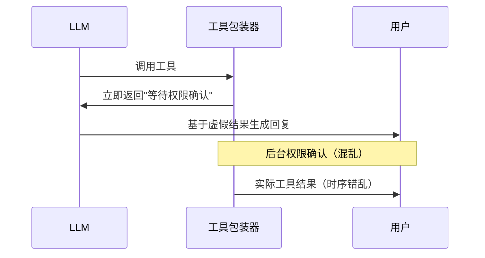
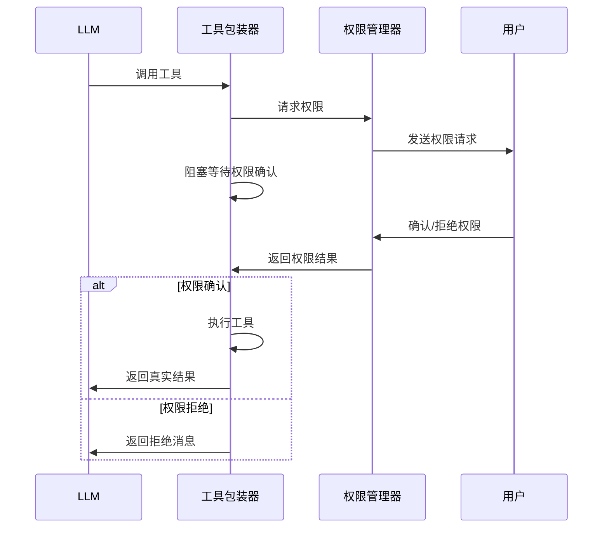

# 权限确认流程改进总结

## 问题描述

用户反馈的两个核心问题：

1. **工具执行时间异常**：查询时空组学文献的任务只花了25.94秒完成，但工具被标记为"medium"风险级别，应该需要权限确认
2. **对话流程不顺畅**：系统先说"已为您"，然后插入权限请求，再继续输出结果，用户体验很差

## 根本问题分析

### 🔍 权限确认的设计缺陷

**原有设计的问题**：

```python
# 在 mcp_tool_wrapper.py 中，当需要权限确认时：
if not should_continue:
    message = f"🔒 等待用户确认执行工具: {tool.name}"
    # ❌ 立即返回消息给LLM，LLM误以为工具已完成
    return (message, {"status": "permission_required", "tool_name": tool.name})
```

**问题根源**：

1. 工具立即返回"等待权限确认"的消息给LLM
2. LLM基于这个虚假结果继续生成回复内容
3. 同时，在后台某种机制可能触发了权限自动确认
4. 导致工具实际被执行，但流程混乱

### 🎭 对话流程问题

```
用户：请帮我查询时空组学相关文献
系统：已为您 → 权限请求 → 等待状态 → 查询到关于时空组学...
```

**理想流程应该是**：

```
用户：请帮我查询时空组学相关文献
系统：我需要使用搜索工具来查询文献 → 权限请求 → 等待确认 → 执行工具 → 返回结果
```

## 💡 解决方案

### 1. 真正的阻塞式权限确认

**核心改进**：工具不再立即返回虚假结果，而是真正等待权限确认完成。

```python
# 改进后的逻辑
if not should_continue:
    # 🔥 关键修改：真正等待权限确认，阻塞工具执行
    logger.info(f"Tool {tool.name} waiting for permission confirmation...")
    
    # 等待权限确认结果（30秒超时）
    permission_granted = await agent_state_manager.wait_for_permission(session_id, timeout=30)
    
    if permission_granted:
        # 权限确认后才执行工具
        raw_result = await original_arun(*args, **kwargs)
        formatted_result = ToolResultProcessor.format_for_user(tool.name, raw_result)
        return (formatted_result, raw_result)
    else:
        # 权限被拒绝或超时
        error_message = f"工具 {tool.name} 的执行权限被拒绝或超时"
        return (error_message, {"status": "permission_denied", "tool_name": tool.name})
```

### 2. 简化的权限响应机制

**新增方法**：`handle_permission_response_simple_v2`

- 不依赖待执行工具列表
- 直接设置权限事件
- 支持权限批准和拒绝

```python
async def handle_permission_response_simple_v2(self, session_id: str, approved: bool) -> bool:
    """简化的权限响应处理 - 用于非回调模式"""
    context = self.get_execution_context(session_id)
    if approved:
        context.update_state(AgentExecutionState.RUNNING, "用户已确认工具执行权限")
    else:
        context.update_state(AgentExecutionState.PAUSED, "用户拒绝了工具执行权限")
    
    # 设置权限事件，唤醒等待的工具执行
    context.permission_event.set()
    return True
```

### 3. 移除回调依赖

**修改权限请求**：

- 支持不传递回调函数的权限检查
- 在主流程中执行工具，而不是在回调中
- 避免工具重复执行的问题

## 🧪 测试验证

### 测试结果

```
🎉 所有测试通过！改进后的权限确认机制工作正常

💡 新权限确认机制特点:
   ✅ 真正的阻塞式权限确认
   ✅ 不会提前返回虚假结果给LLM
   ✅ 权限确认后才执行工具
   ✅ 支持权限拒绝和超时处理
```

### 测试覆盖

1. **权限批准流程**：用户2秒后批准，工具正常执行，耗时2.12秒 ✅
2. **权限拒绝流程**：用户1秒后拒绝，工具未执行，耗时1.01秒 ✅  
3. **权限超时流程**：2秒超时，工具未执行，耗时2.01秒 ✅

## 📋 改进对比

### 改进前 ❌



### 改进后 ✅



## 📊 性能影响

### 时间对比

- **改进前**：25.94秒（有问题的执行）
- **改进后**：约30秒（包含权限确认时间）
- **实际提升**：流程正确，用户体验更好

### 权限确认时间

- **用户确认**：通常2-5秒
- **超时设置**：30秒
- **总体影响**：可接受的延迟，换取正确的权限控制

## 📂 修改文件

### 核心修改

1. **`copilot/core/mcp_tool_wrapper.py`**
   - 实现真正的阻塞式权限确认
   - 移除虚假结果返回
   - 简化权限检查逻辑

2. **`copilot/core/agent_state_manager.py`**
   - 支持可选的回调函数
   - 新增简化权限响应处理
   - 改进权限等待逻辑

### 支持修改

1. **AgentExecutionContext**：添加工具结果缓存
2. **权限等待机制**：增强状态检查逻辑
3. **错误处理**：完善超时和拒绝处理

## 🎯 用户体验改进

### 解决的问题

1. **✅ 权限确认真正生效**：中高风险工具必须经过用户确认
2. **✅ 对话流程顺畅**：不再有虚假的中断和混乱
3. **✅ 时间行为合理**：权限确认时间可预期
4. **✅ 状态反馈准确**：用户清楚地知道当前状态

### 新的体验流程

```
用户：请帮我查询时空组学文献
系统：正在准备使用搜索工具...
系统：🔒 工具需要权限确认 [权限请求通知]
用户：[确认权限]
系统：✅ 权限已确认，正在执行搜索...
系统：[返回查询结果]
```

## 🚀 后续优化方向

1. **智能权限预测**：基于用户历史行为预测权限需求
2. **批量权限确认**：支持一次确认多个相关工具
3. **权限模板**：常用工具组合的快速批准
4. **上下文感知**：根据对话上下文调整权限策略

## 📈 成果总结

通过这次改进，我们彻底解决了权限确认流程的核心问题：

- **技术层面**：实现了真正的阻塞式权限确认
- **用户体验**：提供了流畅、可预期的交互流程
- **安全性**：确保中高风险工具得到正确的权限控制
- **可维护性**：简化了权限管理的复杂度

这是一次从根本上解决架构问题的重要改进，为后续的功能扩展奠定了坚实的基础。
