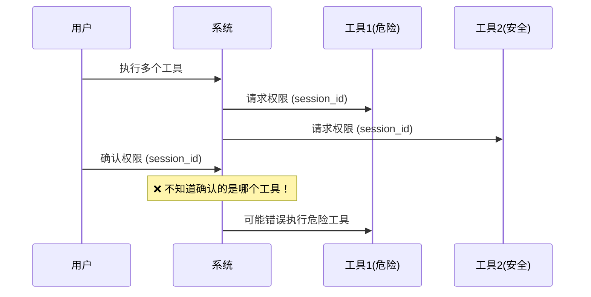
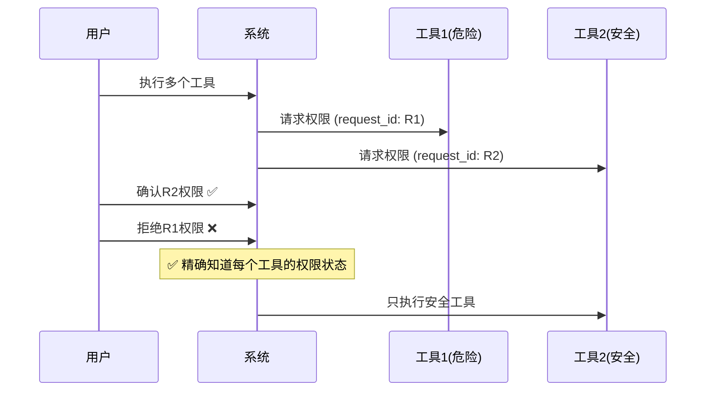

# 基于request_id的权限确认设计分析

## 🎯 问题的核心

您提出的问题非常精准：

> **为什么确认的接口只需要session_id，而不是使用工具调用的一个实例id？**

这个问题揭示了原有权限确认设计的**严重缺陷**。

## ❌ 原有设计的问题

### 1. **仅使用session_id的风险**

```python
# 原有的错误设计
async def handle_permission_response_simple_v2(self, session_id: str, approved: bool):
    # ❌ 只有session_id，无法区分具体是哪个工具！
    pass
```

**问题场景**：
```
用户：请帮我读取file1.txt并删除file2.txt
系统：同时请求两个工具权限
  - read_file (request_id: abc123) - 低风险
  - delete_file (request_id: def456) - 高风险

用户确认权限时：系统无法知道用户确认的是哪个工具！
```

### 2. **并发工具调用的混乱**

**潜在危险**：
- 用户想批准"读取文件"
- 但系统可能误认为批准了"删除文件"
- 导致危险操作被错误执行

### 3. **缺乏精确控制**

- 无法选择性批准部分工具
- 无法追溯权限决策对应的具体工具实例
- 权限管理完全依赖时序，非常不可靠

## ✅ 正确的设计：基于request_id

### 1. **唯一标识原则**

```python
# 正确的设计
async def handle_permission_response(self, session_id: str, request_id: str, approved: bool):
    # ✅ 精确标识具体的工具实例
    context.permission_decisions[request_id] = approved
```

**关键特点**：
- 每个工具调用都有唯一的`request_id`
- 权限确认精确对应到具体的工具实例
- 避免权限确认的混乱和错误

### 2. **安全的并发控制**

```python
# 并发场景下的正确处理
用户：请帮我备份重要文件并清理临时文件
系统生成：
  - backup_files (request_id: aaa111) - medium风险
  - cleanup_temp (request_id: bbb222) - high风险

用户可以：
  - 批准 aaa111 (备份操作)
  - 拒绝 bbb222 (清理操作，太危险)
```

### 3. **完整的权限追溯**

```python
class AgentExecutionContext:
    # 权限决策历史记录
    permission_decisions: Dict[str, bool] = {}  # request_id -> approved
    
    # 可以查询：
    # - 哪些工具被批准了？
    # - 哪些工具被拒绝了？ 
    # - 某个具体工具的权限状态？
```

## 🔍 设计对比分析

### 基于session_id（错误） ❌



### 基于request_id（正确） ✅



## 🛡️ 安全性分析

### 1. **权限隔离**
- 每个工具实例独立的权限控制
- 避免权限"串流"和误操作
- 支持细粒度的权限管理

### 2. **并发安全**
- 多个工具同时请求权限时不会混乱
- 用户可以有选择地批准工具
- 系统能准确执行用户的权限决策

### 3. **审计追溯**
- 完整的权限决策历史
- 可以追溯每个工具的权限状态
- 支持权限分析和优化

## 📋 实现要点

### 1. **request_id生成**
```python
# 在发送权限请求时生成唯一ID
request_id = str(uuid.uuid4())
permission_request = ToolPermissionRequest(
    request_id=request_id,
    tool_name=tool_name,
    # ...
)
```

### 2. **权限决策存储**
```python
# 在执行上下文中记录权限决策
context.permission_decisions[request_id] = approved
```

### 3. **精确权限等待**
```python
# 等待特定工具的权限确认
permission_granted = await agent_state_manager.wait_for_permission_by_request_id(
    session_id, request_id, timeout=30
)
```

## 🎯 您的质疑完全正确

您的观察揭示了原有设计的核心缺陷：

1. **仅使用session_id是不安全的**
2. **缺乏工具实例的唯一标识**  
3. **无法支持并发工具的精确权限控制**

基于request_id的设计是**正确且必要的**，它解决了：
- ✅ 权限确认的精确性
- ✅ 并发工具的安全控制
- ✅ 权限决策的可追溯性
- ✅ 用户体验的一致性

## 📈 改进效果

### 技术层面
- **精确控制**：每个工具实例独立的权限管理
- **并发安全**：支持多工具并发权限确认
- **错误预防**：避免权限确认的混乱和误操作

### 用户体验
- **清晰反馈**：用户明确知道确认的是哪个工具
- **灵活控制**：可以选择性批准部分工具
- **安全保障**：危险操作不会被误批准

### 安全性
- **权限隔离**：工具间权限完全独立
- **审计追溯**：完整的权限决策历史
- **风险控制**：精确的权限管理机制

这是一次从根本上修复权限确认设计缺陷的重要改进，确保了系统的安全性和可靠性。 