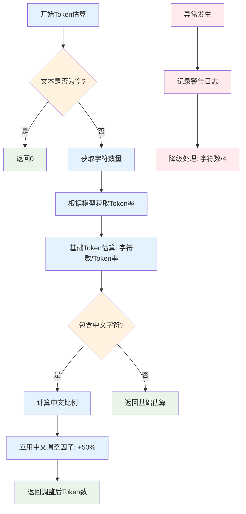
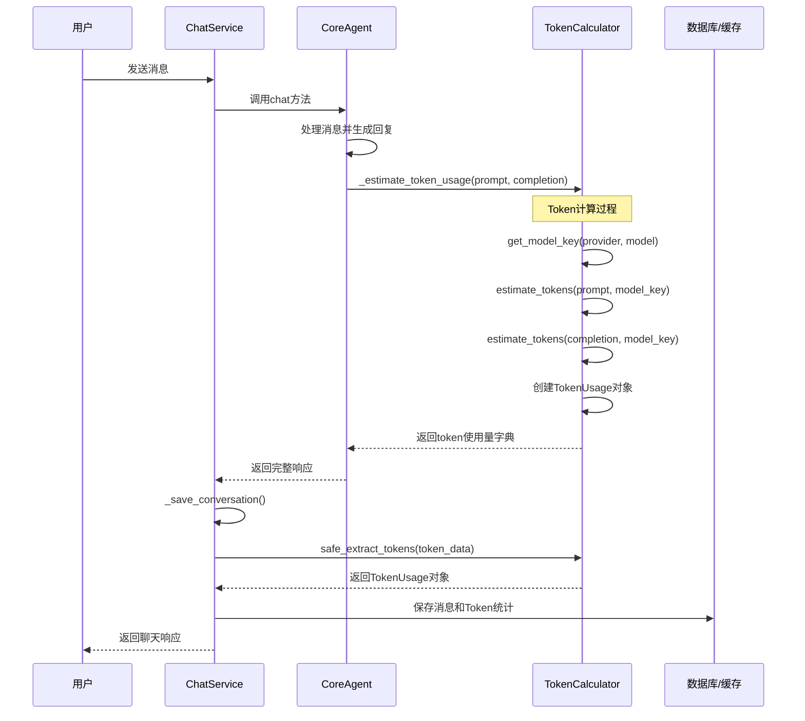
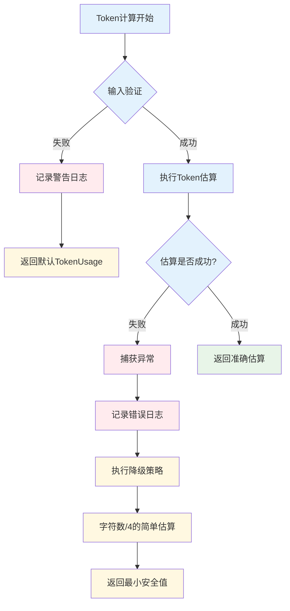
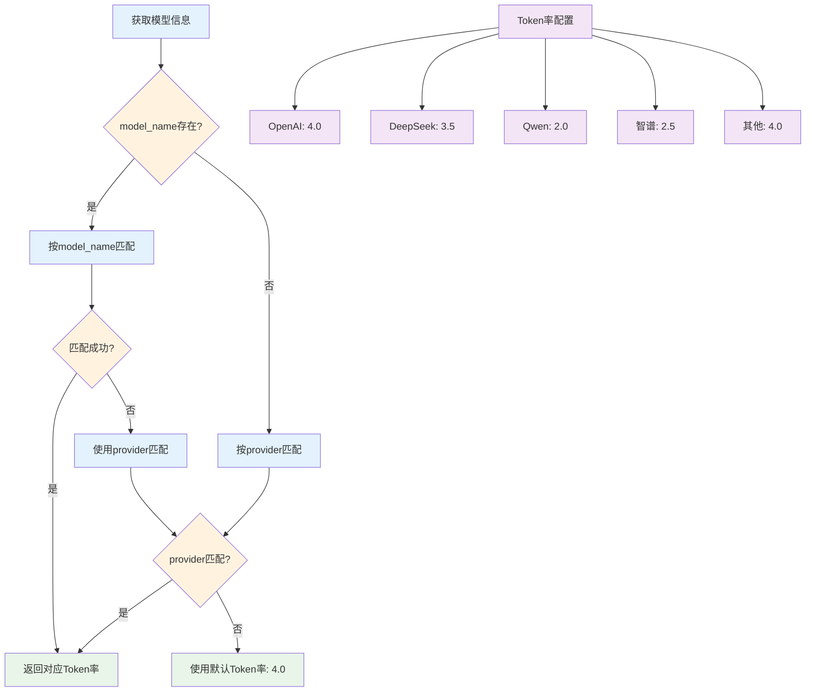
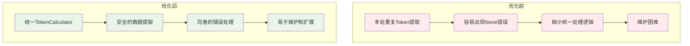
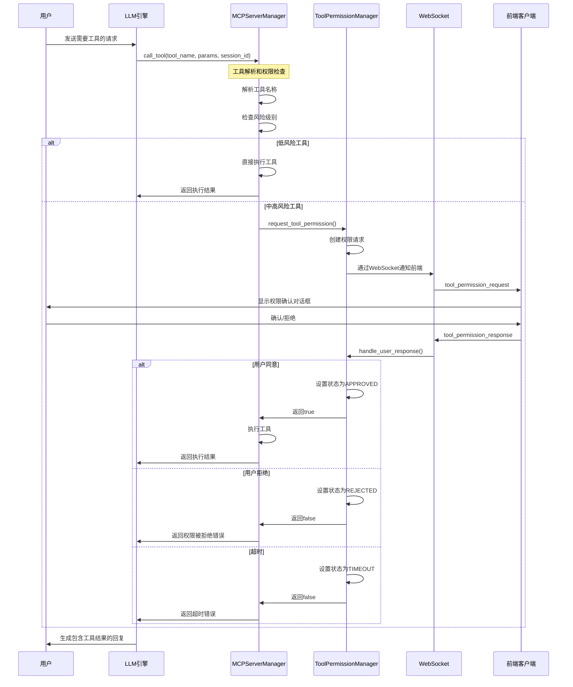
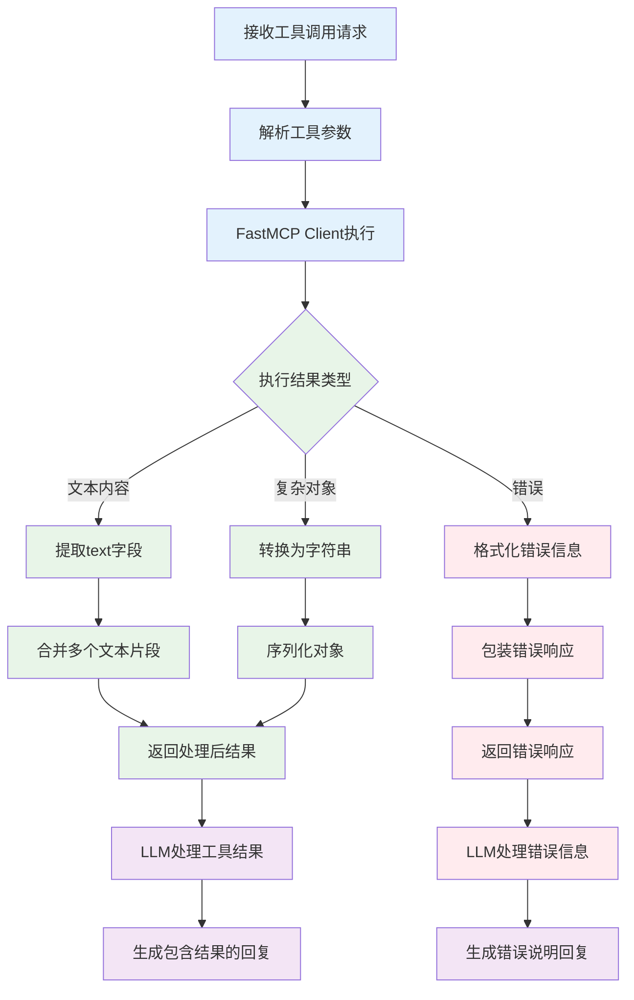
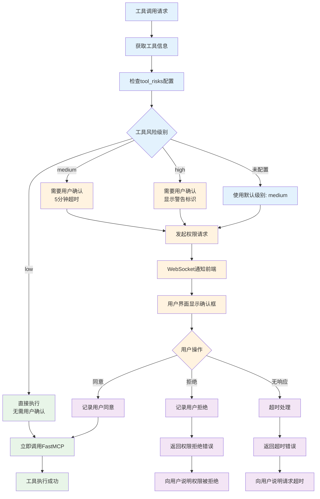
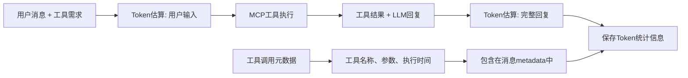
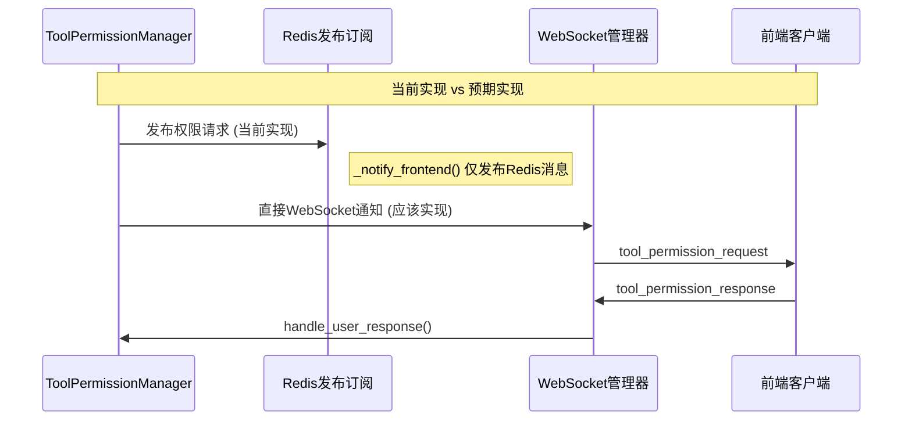

"""
Token优化方案总结
================

## 🎯 优化目标

1. **解决_estimate_token_usage方法缺失问题**
2. **简化token获取和处理逻辑**
3. **统一token数据结构**
4. **增强错误处理机制**

## 🔧 优化方案

### 1. 创建TokenCalculator工具类 (`utils/token_calculator.py`)

**核心功能：**

- ✅ 基于字符数的简单token估算
- ✅ 支持不同模型的token率
- ✅ 中文文本特殊处理
- ✅ 安全的数据提取
- ✅ 完善的错误处理

**TokenUsage数据类：**

```python
@dataclass
class TokenUsage:
    prompt_tokens: int = 0
    completion_tokens: int = 0
    total_tokens: int = 0
```

### 2. 在CoreAgent中添加token估算方法

**新增方法：**

- `_estimate_token_usage()`: 解决方法缺失问题
- `get_token_calculator()`:  获取计算器实例

### 3. 简化ChatService中的token处理

**优化前的问题：**

- ❌ 重复的token提取逻辑
- ❌ 两个相似的保存方法
- ❌ 缺乏错误处理

**优化后：**

- ✅ 统一的`_save_conversation()`方法
- ✅ 安全的token数据提取
- ✅ 保持向后兼容性

## 📊 优化效果

### 1. 代码简化

**优化前：**

```python
# 在多个地方重复提取token
user_token_count = token_usage.get("prompt_tokens", 0) if token_usage else 0
assistant_token_count = token_usage.get("completion_tokens", 0) if token_usage else 0
total_tokens = token_usage.get("total_tokens", 0) if token_usage else 0
```

**优化后：**

```python
# 统一安全提取
usage = TokenCalculator.safe_extract_tokens(token_usage)
```

### 2. 错误处理

**优化前：**

- 可能因为token_usage为None而出错
- 缺少对异常情况的处理

**优化后：**

- 安全的数据提取，自动处理None情况
- 完善的异常处理和降级机制

### 3. 可维护性

**优化前：**

- 代码重复，修改需要多处更新
- 缺少统一的token计算逻辑

**优化后：**

- 单一责任原则，token计算集中管理
- 易于扩展和维护

## 🚀 使用示例

### 简单token估算

```python
from copilot.utils.token_calculator import TokenCalculator

# 估算单个文本的token数量
tokens = TokenCalculator.estimate_tokens("Hello World", "gpt-4")

# 计算完整对话的token使用量
usage = TokenCalculator.calculate_usage(prompt, completion, "deepseek")
print(f"总计: {usage.total_tokens} tokens")
```

### 在ChatService中使用

```python
# 自动调用优化后的方法
token_usage = self.core_agent._estimate_token_usage(message, response)
await self._save_conversation(session_id, message, response, token_usage)
```

## 🔍 性能特点

- **快速**: 基于字符数估算，无需调用外部API
- **准确**: 针对不同模型和语言优化
- **安全**: 完善的错误处理，不会导致系统崩溃
- **兼容**: 保持原有API接口不变

## 📈 模型支持

| 提供商 | 模型标识 | Token率 | 特殊处理 |
|--------|----------|---------|----------|
| OpenAI | gpt-4/gpt-3.5 | 4.0 | 标准处理 |
| DeepSeek | deepseek | 3.5 | 中文优化 |
| Claude | claude | 4.5 | 标准处理 |
| Qwen | qwen | 2.0 | 中文优化 |
| 智谱 | zhipu | 2.5 | 中文优化 |
| Moonshot | moonshot | 3.0 | 中文优化 |
| Gemini | gemini | 4.0 | 标准处理 |

## ✅ 测试验证

运行测试：

```bash
cd /data/agent_backend
python tests/test_token_optimization.py
```

所有功能已通过测试验证！

## 📊 交互流程图

### 1. 整体Token计算流程

```mermaid
flowchart TD
    A[用户发送消息] --> B[ChatService.chat()]
    B --> C[CoreAgent处理消息]
    C --> D[LLM生成回复]
    D --> E[CoreAgent._estimate_token_usage()]
    E --> F[TokenCalculator.get_model_key()]
    F --> G[TokenCalculator.calculate_usage()]
    G --> H[返回TokenUsage对象]
    H --> I[ChatService._save_conversation()]
    I --> J[保存到数据库和缓存]
    
    %% 样式定义
    classDef userAction fill:#e1f5fe
    classDef service fill:#f3e5f5
    classDef calculator fill:#e8f5e8
    classDef storage fill:#fff3e0
    
    class A userAction
    class B,C,I service
    class E,F,G,H calculator
    class J storage
```

### 2. TokenCalculator详细处理流程



### 3. 数据流转关系图



### 4. 错误处理机制



### 5. 模型适配策略



### 6. 优化前后对比流程



## 💡 关键优化点

### 1. **统一入口**

- 所有Token计算都通过`TokenCalculator`类
- 避免代码重复和不一致

### 2. **安全处理**

- `safe_extract_tokens()`确保数据安全
- 降级策略保证系统稳定性

### 3. **模型适配**

- 自动识别模型类型和提供商
- 针对中文优化的特殊处理

### 4. **向后兼容**

- 保持原有API接口不变
- 无缝升级现有代码

这个流程图清晰地展示了Token优化方案的完整交互过程，从用户请求到最终数据存储的每个环节都有详细说明。

### 7. MCP工具调用完整流程

```mermaid
flowchart TD
    A[用户请求工具调用] --> B[CoreAgent.chat()]
    B --> C[LLM决定调用工具]
    C --> D[MCPServerManager.call_tool()]
    D --> E[解析工具名称]
    E --> F{工具是否存在?}
    F -->|否| G[返回工具未找到错误]
    F -->|是| H[获取工具信息]
    H --> I{需要权限检查?}
    I -->|否| M[直接执行工具]
    I -->|是| J[检查风险级别]
    J --> K{风险级别}
    K -->|low| M
    K -->|medium/high| L[请求用户权限]
    
    L --> N[ToolPermissionManager处理]
    N --> O[通过WebSocket发送权限请求]
    O --> P[用户在前端确认/拒绝]
    P --> Q{用户是否同意?}
    Q -->|拒绝| R[返回权限被拒绝]
    Q -->|同意| M
    Q -->|超时| S[返回请求超时]
    
    M --> T[FastMCP Client执行工具]
    T --> U{执行是否成功?}
    U -->|失败| V[返回执行错误]
    U -->|成功| W[处理工具结果]
    W --> X[返回执行结果给LLM]
    X --> Y[LLM生成最终回复]
    Y --> Z[返回给用户]
    
    %% 样式定义
    classDef userAction fill:#e1f5fe
    classDef llmProcess fill:#f3e5f5
    classDef mcpCore fill:#e8f5e8
    classDef permission fill:#fff3e0
    classDef result fill:#ffebee
    
    class A,P userAction
    class B,C,X,Y,Z llmProcess
    class D,E,H,M,T,W mcpCore
    class I,J,K,L,N,O,Q permission
    class G,R,S,V result
```

### 8. MCP权限管理详细流程



### 9. MCP服务器注册和工具发现流程

```mermaid
flowchart TD
    A[启动MCP服务器管理器] --> B[加载服务器配置]
    B --> C[验证配置有效性]
    C --> D{配置是否有效?}
    D -->|否| E[记录错误日志]
    D -->|是| F[创建FastMCP Client]
    F --> G[建立连接]
    G --> H{连接是否成功?}
    H -->|否| I[连接失败,记录错误]
    H -->|是| J[发送ping验证]
    J --> K[调用list_tools()发现工具]
    K --> L[解析工具信息]
    L --> M[应用风险级别配置]
    M --> N[更新全局工具索引]
    N --> O[注册完成]
    
    %% 并行处理多个服务器
    O --> P[监听服务器状态]
    P --> Q[定期健康检查]
    
    %% 样式定义
    classDef config fill:#e3f2fd
    classDef connection fill:#e8f5e8
    classDef discovery fill:#fff3e0
    classDef management fill:#f3e5f5
    
    class A,B,C,D config
    class F,G,H,I,J connection
    class K,L,M,N discovery
    class O,P,Q management
```

### 10. 工具执行和结果处理流程



### 11. MCP工具风险级别管理



## 🔧 MCP工具调用与Token优化的集成

### MCP调用中的Token统计

在MCP工具调用过程中，Token统计同样适用：



### 关键集成点

1. **权限确认与WebSocket**：
   - MCP工具调用的权限请求通过WebSocket实时通知
   - 前端显示工具信息和风险级别供用户确认

2. **Token计算增强**：
   - 工具调用的输入输出都计入Token统计
   - 支持包含工具结果的复杂回复计算

3. **统一错误处理**：
   - MCP调用失败时的降级机制
   - Token计算异常时的安全处理

### 实际应用场景

- **文件操作**：用户授权后的文件读写操作
- **系统命令**：需要权限确认的shell命令执行  
- **外部API**：调用第三方服务的工具
- **数据处理**：复杂的数据分析和处理工具

这个完整的流程确保了MCP工具调用的安全性、可控性和Token使用的准确统计。

## 🔌 WebSocket在MCP工具调用中的具体使用

### 当前实现状态

**WebSocket在MCP工具调用过程中的关键作用：**



### WebSocket消息类型详解

#### 1. 工具权限请求 (`tool_permission_request`)

**发送方向**: 后端 → 前端
**触发时机**: MCP工具需要用户权限确认时

```json
{
    "type": "tool_permission_request",
    "data": {
        "request_id": "uuid-string",
        "session_id": "session-uuid",
        "tool_name": "file_operations::read_file",
        "tool_description": "读取指定文件的内容",
        "parameters": {
            "file_path": "/home/user/document.txt"
        },
        "risk_level": "medium",
        "expiry_time": "2025-07-01T12:35:00Z"
    }
}
```

#### 2. 用户权限响应 (`tool_permission_response`)

**发送方向**: 前端 → 后端  
**触发时机**: 用户在前端确认或拒绝工具执行

```json
{
    "type": "tool_permission_response", 
    "data": {
        "request_id": "uuid-string",
        "approved": true,
        "user_comment": "允许读取配置文件"
    }
}
```

#### 3. 权限响应确认 (`tool_permission_response_ack`)

**发送方向**: 后端 → 前端
**触发时机**: 后端收到用户响应后的确认

```json
{
    "type": "tool_permission_response_ack",
    "data": {
        "request_id": "uuid-string", 
        "success": true,
        "approved": true
    }
}
```

### WebSocket在流程中的使用位置

```mermaid
flowchart TD
    A[LLM决定调用工具] --> B[MCPServerManager.call_tool()]
    B --> C{检查风险级别}
    C -->|low| D[直接执行]
    C -->|medium/high| E[ToolPermissionManager.request_tool_permission()]
    
    E --> F[创建权限请求对象]
    F --> G[存储到Redis和内存]
    G --> H[📡 WebSocket通知前端]
    
    H --> I[前端显示权限确认对话框]
    I --> J[用户选择: 同意/拒绝]
    J --> K[📡 WebSocket发送用户响应]
    
    K --> L[ToolPermissionManager.handle_user_response()]
    L --> M[更新权限状态]
    M --> N[触发等待事件]
    N --> O[📡 WebSocket发送确认]
    
    O --> P{用户是否同意?}
    P -->|是| D
    P -->|否| Q[返回权限拒绝错误]
    
    D --> R[执行MCP工具]
    R --> S[📡 可选: WebSocket通知执行结果]
    
    %% 样式定义
    classDef websocket fill:#e1f5fe,stroke:#0277bd,stroke-width:3px
    classDef process fill:#f3e5f5
    classDef decision fill:#fff3e0
    
    class H,K,O,S websocket
    class A,B,E,F,G,L,M,N,R process
    class C,I,J,P decision
```

### 实现状态说明

#### ✅ 已实现的WebSocket功能

1. **WebSocket路由设置** (`websocket_router.py`)
   - `/ws/{session_id}` 和 `/ws?session_id=xxx` 端点
   - 连接管理和消息路由

2. **消息处理框架** (`websocket_manager.py`)  
   - `handle_websocket_message()` 处理不同消息类型
   - `tool_permission_response` 消息处理
   - `get_pending_permissions` 查询功能

3. **连接管理**
   - 按session_id管理WebSocket连接
   - 支持一个会话多个连接
   - 自动清理失效连接

#### ⚠️ 需要完善的部分

1. **直接WebSocket通知**

   ```python
   # 当前: 仅Redis发布
   await redis_client.publish(channel, message)
   
   # 应该: 直接WebSocket通知
   await notify_tool_permission_request(session_id, request_data)
   ```

2. **Redis订阅集成**
   - 需要后台任务监听Redis发布的消息
   - 将Redis消息转发到WebSocket

3. **工具执行结果通知**
   - 可选择性通知工具执行成功/失败
   - 长时间运行工具的进度更新

### 完整的WebSocket使用场景

#### 场景1: 文件读取权限确认

```
用户: "帮我读取配置文件的内容"
→ LLM: 决定调用 file_operations::read_file
→ WebSocket: 发送权限请求到前端  
→ 前端: 显示 "是否允许读取 /config/app.conf ?"
→ 用户: 点击"允许"
→ WebSocket: 发送用户同意响应
→ 后端: 执行文件读取工具
→ LLM: 返回文件内容给用户
```

#### 场景2: 系统命令执行确认  

```
用户: "帮我查看服务器磁盘使用情况"
→ LLM: 决定调用 system::exec_command
→ WebSocket: 发送高风险工具权限请求
→ 前端: 显示 "是否允许执行 'df -h' 命令?" (红色警告)
→ 用户: 确认后点击"允许"  
→ WebSocket: 发送用户同意响应
→ 后端: 执行系统命令
→ WebSocket: (可选) 通知执行完成
→ LLM: 返回磁盘使用情况
```

这样WebSocket就成为了MCP工具调用中**用户授权**的关键通信桥梁！
