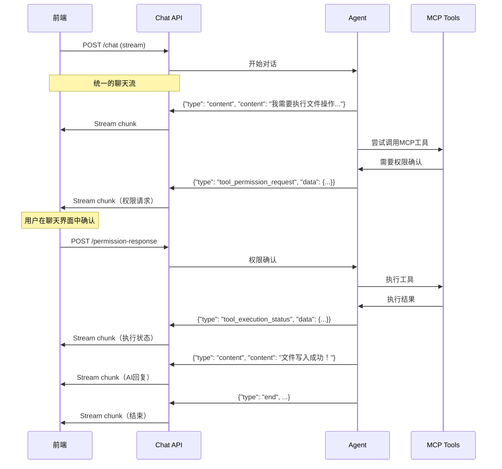

# 统一聊天通信方案提案

## 问题描述

当前系统存在通信方式割裂的问题：

### 现状

- **聊天输出**：HTTP StreamingResponse
- **工具权限确认**：SSE推送

### 问题

1. **前端复杂度**：需要同时处理两种不同的通信协议
2. **用户体验割裂**：权限确认和聊天内容在不同的通道
3. **同步问题**：两个流之间可能出现时序问题
4. **开发维护成本**：需要维护两套通信机制

## 解决方案：聊天流集成权限确认

### 核心思路

将工具权限确认集成到现有的聊天流中，通过扩展消息类型实现统一的用户体验。

### 实现方案

#### 1. 扩展聊天流消息类型

**当前聊天流消息类型**：

```json
{"type": "start", "session_id": "xxx"}
{"type": "content", "content": "AI回复内容"}
{"type": "end", "session_id": "xxx", "message_ids": {...}}
{"type": "error", "content": "错误信息"}
```

**新增权限确认消息类型**：

```json
// 工具权限请求
{
  "type": "tool_permission_request",
  "session_id": "xxx",
  "data": {
    "request_id": "uuid",
    "tool_name": "file_write",
    "tool_description": "写入文件内容",
    "parameters": {"file_path": "/test.txt"},
    "risk_level": "medium"
  }
}

// 工具执行状态
{
  "type": "tool_execution_status", 
  "session_id": "xxx",
  "data": {
    "request_id": "uuid",
    "tool_name": "file_write",
    "status": "executing|completed|failed",
    "result": "执行结果（可选）"
  }
}
```

#### 2. 修改Agent执行流程

**目标流程**：



#### 3. 权限响应处理

**新增API端点**：

```python
@router.post("/permission-response")
async def handle_permission_response(
    session_id: str,
    request_id: str,
    approved: bool,
    current_user: dict = Depends(get_current_user_from_state)
):
    """处理工具权限响应"""
    # 调用AgentStateManager处理权限响应
    # 无需中断聊天流，权限确认后工具会在回调中执行
    pass
```

#### 4. 前端实现示例

```javascript
// 统一的聊天流处理
async function handleChatStream(sessionId, message) {
    const response = await fetch('/api/chat', {
        method: 'POST',
        headers: {'Content-Type': 'application/json'},
        body: JSON.stringify({
            session_id: sessionId,
            message: message
        })
    });

    const reader = response.body.getReader();
    const decoder = new TextDecoder();

    while (true) {
        const { done, value } = await reader.read();
        if (done) break;

        const chunk = decoder.decode(value);
        const events = chunk.split('\n').filter(line => line.trim());

        for (const eventStr of events) {
            try {
                const event = JSON.parse(eventStr);
                await handleChatEvent(event);
            } catch (e) {
                console.error('Failed to parse event:', e);
            }
        }
    }
}

async function handleChatEvent(event) {
    switch (event.type) {
        case 'content':
            appendChatMessage('assistant', event.content);
            break;
            
        case 'tool_permission_request':
            showPermissionDialog(event.data);
            break;
            
        case 'tool_execution_status':
            updateToolStatus(event.data);
            break;
            
        case 'end':
            markChatComplete(event.session_id);
            break;
    }
}

async function handlePermissionResponse(requestId, approved) {
    await fetch('/api/permission-response', {
        method: 'POST',
        headers: {'Content-Type': 'application/json'},
        body: JSON.stringify({
            session_id: currentSessionId,
            request_id: requestId,
            approved: approved
        })
    });
}
```

## 实现计划

### 阶段1：核心改造

1. **修改ChatStreamHandler**：支持工具权限消息类型
2. **修改MCPToolWrapper**：通过聊天流发送权限请求
3. **新增权限响应API**：处理HTTP权限确认

### 阶段2：优化体验

1. **前端统一处理**：单一流处理所有事件
2. **状态同步**：确保权限确认和执行状态的实时性
3. **错误处理**：统一的错误处理机制

### 阶段3：逐步迁移

1. **保持SSE兼容**：渐进式迁移，避免破坏性变更
2. **性能优化**：确保统一流的性能不低于当前方案
3. **完整测试**：全面测试新的通信方案

## 优势分析

### 用户体验

- ✅ **统一界面**：所有交互都在聊天界面中完成
- ✅ **自然流程**：权限确认作为对话的一部分
- ✅ **实时反馈**：工具执行状态实时显示

### 技术优势

- ✅ **简化架构**：单一通信通道
- ✅ **降低复杂度**：前端只需处理一个流
- ✅ **更好的可测试性**：统一的消息协议
- ✅ **易于扩展**：可以轻松添加新的消息类型

### 开发效率

- ✅ **维护成本低**：单一通信机制
- ✅ **调试简单**：所有消息都在同一个流中
- ✅ **文档统一**：单一的API文档

## 向后兼容

为了确保平滑迁移，建议：

1. **保留SSE端点**：短期内并存，逐步废弃
2. **添加配置选项**：允许选择通信方式
3. **渐进式迁移**：先在新功能中使用，再迁移旧功能

## 风险评估

### 技术风险

- **流中断问题**：需要确保权限确认不会中断聊天流
- **性能影响**：统一流可能比独立SSE性能稍低
- **复杂消息处理**：前端需要处理更复杂的消息类型

### 缓解措施

- **完善的错误处理**：确保任何异常都不会中断聊天
- **性能测试**：充分测试新方案的性能表现
- **逐步迁移**：分阶段实施，降低风险

## 总结

统一聊天通信方案能够显著改善用户体验，降低系统复杂度，是一个值得实施的优化方案。建议采用渐进式实施策略，确保系统稳定性的同时提升用户体验。
